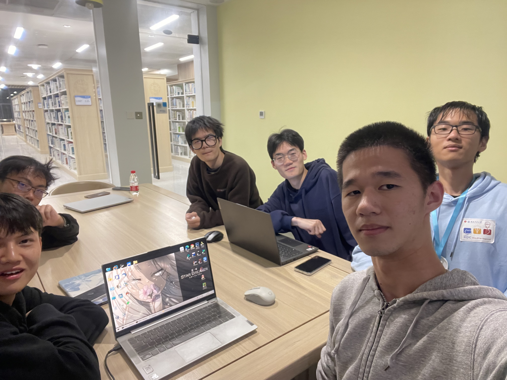

# 第六周会议记录

### 1.会议照片

### 2.会议内容

整个项目分为前端组和后端组进行。

前端组成员为：洪曹奕、刘家诚、余会涛

后端组成员为：李俊义、刘思凯、陈岳阳

会议确认了双方的负责范围，并作出如下安排：

1.前端组负责插件初步功能的实现以及官网大致框架的搭建。

2.后端组负责数据库与服务器的初步搭建。

### 3.本周任务与完成情况

前端组预计任务如下：

（1）官网：
1.登陆页面*
2.注册页面*
3.用户做有笔记的网站的查询页面
4.查询特定网站所有公开笔记

（2）插件
1.popup界面*
2.backgound*
3.content_script*
4.设置页面
5.侧边栏页面

右侧记有星号的为Alpha迭代需要完成的内容。

具体功能方面：

Alpha迭代尝试完成网页笔记功能以及高亮功能基础。

后端组预计任务：

搭建数据库与后台服务器，处理前端传回数据。

具体功能方面：

Alpha迭代尝试完成网页笔记存储功能以及高亮存储功能。

